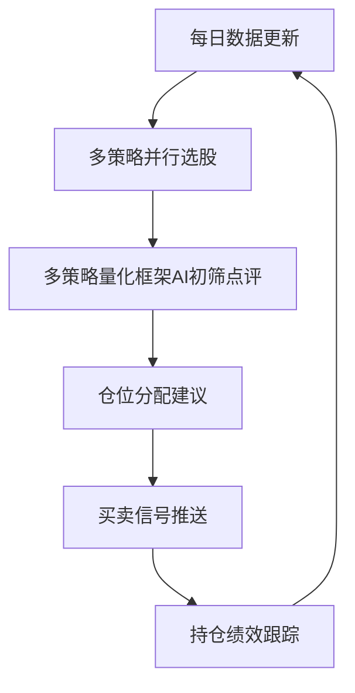

# A股量化交易系统 项目文档

---

## 一、量化交易智能体演进路线

当前状态：已经完成了基础选股策略代码化 + 多策略量化投资认知Skill化 + 多数据源整合。

现在只是"选股工具 + 投资助手"，要演进成完整的**量化智能体**，可以分三个阶段走：

---

### 数据层架构：baostock + AkShare + efinance 混合兜底模式

**设计思路：baostock为主，多个数据源兜底，不破坏原有接口**

| 数据源 | 负责 | 已实现 |
|--------|------|--------|
| **baostock** | K线日线、ROE毛利率等基础财务数据 | ✅ |
| **AkShare** | 股息率（高股息策略）、申万行业分类、市值 | ✅ |
| **efinance** | K线兜底（baostock/AkShare都被封时） | ✅ |

**文件位置**：
- `src/data/baostock_api.py` - 主接口，原有功能不变
- `src/data/akshare_api.py` - 补充接口（股息率、行业分类）
- `src/data/efinance_api.py` - K线兜底
- `src/data/cache.py` - 本地缓存读写

**当前补充内容**：
- ✅ 股息率获取 → 高股息策略现在真正按股息率筛选了，不再简化
- ✅ 申万行业分类获取 → 后续可以做行业轮动
- ✅ 最新市值获取 → 可以按市值大小过滤
- ✅ 三层自动兜底 → baostock/AkShare被封自动切下一个源
- 🔄 更多补充按需增加

---

### 第一阶段：每日自动选股 + AI点评（近期可落地）

#### 目标
从手动运行选股 → 自动产出选股报告 → AI基于多策略量化投资框架做点评

#### 具体工作
1. **入口脚本**：写一个主脚本，按顺序运行所有选股策略
   - 价值选股、双低、高股息、小阳建仓、520战法 全部跑一遍
   - 汇总结果到一个文件里

2. **AI自动点评**：调用Claude（加载`a-share-trading-mentor` Skill）
   - 对每只选出的股票，结合多策略量化框架做简短点评
   - 点评内容包括：位置判断、形态符合度、风险提示

3. **输出报告**：生成Markdown/HTML格式日报
   - 按策略分组展示
   - 包含代码、名称、PE、ROE、最新价、AI点评

4. **可选：自动推送**：推送到微信/邮件，不用手动看

#### 价值
- 不用你手动一个个跑策略
- AI帮你初筛，节省时间
- 每天开盘前就能拿到选股结果+分析

---

### 第二阶段：回测验证 + 策略评分（中期，提升决策质量）

#### 目标
现在选股策略都是"定性"来的，不知道实际赚钱效果如何。用回测找到真正有效的策略。

#### 具体工作
1. **回测框架**：对每个选股策略做历史回测（最近3-5年）
   - 买入规则：选出后N天买入
   - 卖出规则：持有N天 / 跌破止损线 / 达到止盈目标
   - 计算绩效：胜率、年化收益、最大回撤、夏普比率

2. **策略融合打分**：
   - 多个策略同时满足的股票给更高分
   - 比如：同时满足"价值选股 + 小阳建仓形态" → 优先级更高

3. **绩效可视化**：
   - 画出净值曲线，对比沪深300超额收益
   - 每个策略单独一张绩效表

#### 价值
- 用数据说话，知道哪个策略真的赚钱
- 避免"感觉有用"但实际不赚钱的策略

---

### 第三阶段：完整投研闭环智能体（中长期）

构建从数据 → 选股 → 分析 → 决策 → 跟踪 → 复盘的完整闭环

#### 核心模块

| 模块 | 功能 |
|------|------|
| **数据自动更新** | 每日自动更新K线、财务数据，更新缓存 |
| **多策略选股** | 所有策略并行运行，输出候选池 |
| **AI初筛点评** | 用多策略量化投资框架分析，过滤掉不符合的 |
| **仓位建议** | 根据总资金、风险偏好，给出具体分仓建议 |
| **信号推送** | 买/卖/持有信号推送到手机 |
| **绩效跟踪** | 记录每笔交易盈亏，定期复盘 |
| **策略迭代** | 根据回测结果，动态调整策略参数 |

---

### 功能增强方向

#### 基础增强（低难度，高收益）

| 功能 | 说明 |
|------|------|
| **止损提醒** | 持仓跌破20日线/趋势走坏自动提醒卖出 |
| **风控控制** | 满仓时禁止新开仓，单票仓位不超限额 |
| **持仓复盘** | 每周/每月自动统计交易绩效，总结问题 |

#### 进阶增强（中高难度）

| 功能 | 说明 |
|------|------|
| **行业轮动** | 结合宏观数据（PMI、利率、成交量）判断当前该配什么行业 |
| **实盘对接** | 对接券商API（华泰OpenAPI/聚宽/米筐），自动下单 |
| **舆情监控** | 监控持仓股票的新闻公告，利空自动提醒 |
| **情绪指标** | 用成交额/涨跌家数判断市场情绪温度，给出整体仓位建议 |

---

### 当前阶段：多数据源整合 + 多策略选股 + 日报 + 初步回测

当前正在推进：

1. **多数据源架构** - baostock为主，AkShare/efinance做数据补充兜底
   - baostock：K线、基础ROE/毛利率
   - AkShare：股息率、行业分类、分红数据补充
   - efinance：K线兜底，东方财富被封时用
2. **多策略并行选股** - 整合所有已实现策略，一键运行全部选股
3. **自动生成日报** - 汇总结果，AI点评，输出markdown报告
4. **初步回测框架** - 对选股结果做简单历史回测，验证策略有效性

---

### 优先级建议

**当前聚焦第一阶段+初步回测**：`多策略选股 + 自动日报 + 初步回测验证`

理由：
1. 基于现有代码，改动量可控
2. 快速拿到可使用的结果，验证策略有效性
3. 形成完整的"选股→报告→回测验证"最小闭环

---

### 当前已完成清单

- [x] 多策略量化投资认知整理为Claude Skill
- [x] 多个选股策略代码实现（价值/双低/高股息/小阳建仓/520）
- [x] 数据缓存机制（K线/财务数据）
- [x] 多数据源整合（baostock + AkShare + efinance三层兜底）
- [x] `download all`一键下载全部数据
- [x] `download from-result`只下载选股结果中需要的K线
- [x] 高股息策略真正股息率筛选（AkShare补充）
- [ ] 多策略入口汇总脚本（已做了`screen all`）
- [ ] AI自动点评集成
- [ ] 每日自动选股日报生成
- [ ] 初步回测框架
- [ ] 绩效统计

---

## 二、缓存数据修改建议

面向系统正式上线后的数据存储演进方案。当前用「多个 CSV 文件当数据库」的做法在原型阶段够用，上线后会暴露性能和维护问题，本文档给出分类改造建议。

---

### 一、当前问题

现状是几千个小 CSV 文件充当数据库：

- `data/universe/all_stocks_pe.csv` —— 全市场列表 + PE/PB（约 5201 只）
- `data/cache/{code}_finance.csv` —— 每只股票一个财务文件
- `data/cache/{code}_kline.csv` —— 每只股票一个 K线文件
- `data/outputs/*.csv` —— 选股结果输出

上线后的主要痛点：

1. **文件数量爆炸**：5000+ 个 finance/kline 小文件，拖慢文件系统。
2. **无法横截面查询**：想筛「所有 ROE>15% 的股票」得挨个读文件，慢且笨。
3. **类型信息丢失**：日期存成字符串，每次加载都要重新 `pd.to_datetime` 解析。
4. **并发写不安全**：多进程/多策略同时写没有原子性和加锁机制。
5. **体积大、加载慢**：CSV 无压缩，读写都慢。

---

### 二、按数据类型的改造建议

规模前提：A股约 5000 只、日频数据。

| 数据类型 | 现状 | 建议 | 理由 |
|---|---|---|---|
| 全市场列表 + PE/PB、财务指标、选股结果 | 多个 CSV | **SQLite**（单文件） | 需要横截面查询（"筛所有达标的"），SQL 一句话搞定；单文件零运维；自带类型和索引 |
| K线（时序、量大） | 每股一个 CSV | **Parquet**（列式压缩） | 体积比 CSV 小 3-5 倍，加载快一个数量级，保留 datetime 类型；pandas 原生 `read_parquet` |
| 对外输出 / 日报 | CSV | **保留 CSV / Excel** | 给人看的，CSV 最通用，不用改 |

---

### 三、最省心的一步到位方案：DuckDB

DuckDB 能直接用 SQL 查询 Parquet 文件，是分析型引擎，回测时做横截面/时序聚合特别快，目前量化圈很流行。相当于「Parquet 存 + SQL 查」二合一，比 SQLite 更适合后面要做的回测。

- 存储：K线等大表用 Parquet 落地
- 查询：DuckDB 直接 `SELECT ... FROM 'data/kline/*.parquet'`，无需导入
- 优势：横截面 + 时序聚合快，语法是标准 SQL，与 pandas 无缝互转

---

### 四、不建议采用的方案（过度设计）

在当前规模下属于杀鸡用牛刀：

- **MySQL / PostgreSQL**：需要起服务的数据库，单机日频用不着。
- **ClickHouse / InfluxDB 等时序数据库**：面向分钟级 / tick 级、几十亿行的场景才需要。

---

### 五、迁移优先级与落地路径

1. **第一步（收益最大）**：K线 CSV → Parquet。加载快、省空间，改动集中在 `src/data/cache.py` 的 K线读写函数。
2. **第二步**：财务指标、universe 列表 → SQLite 或 DuckDB，获得横截面查询能力。
3. **保持不变**：选股结果 / 日报仍输出 CSV，方便人查看。

选股逻辑基本不用改，核心改动都集中在 `src/data/cache.py` 的读写函数，风险可控。
